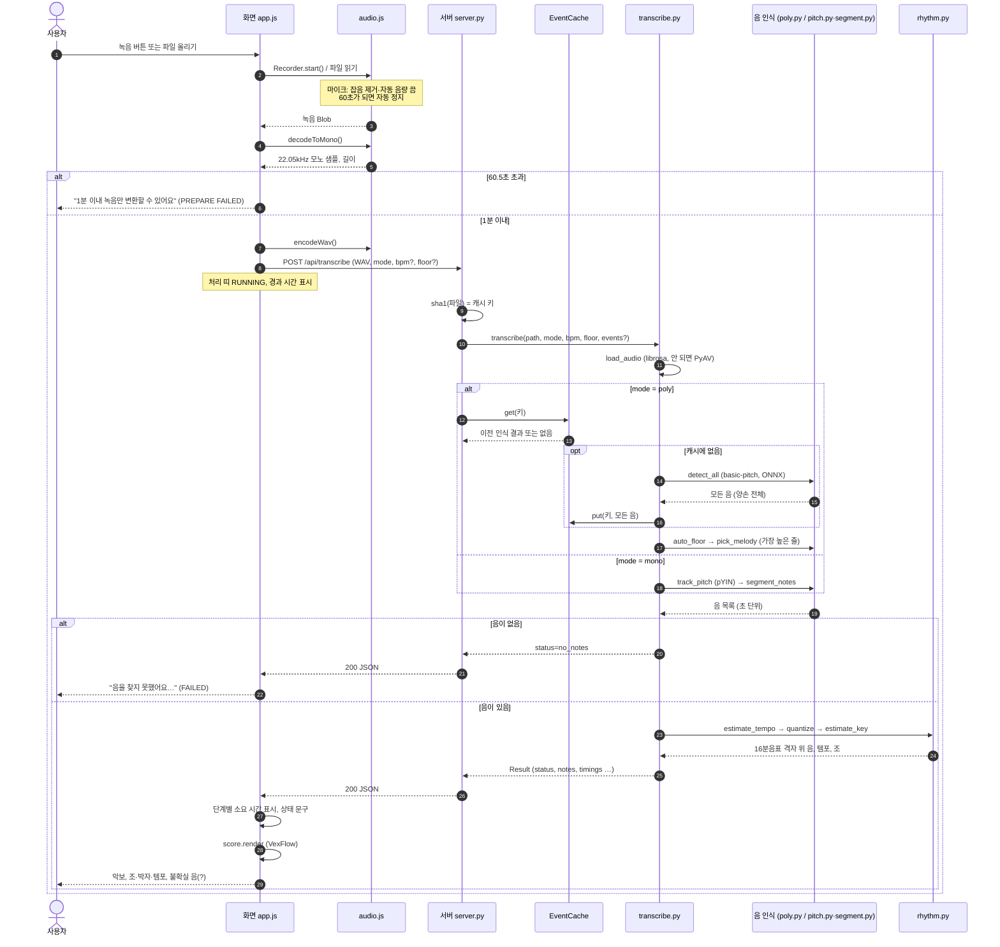
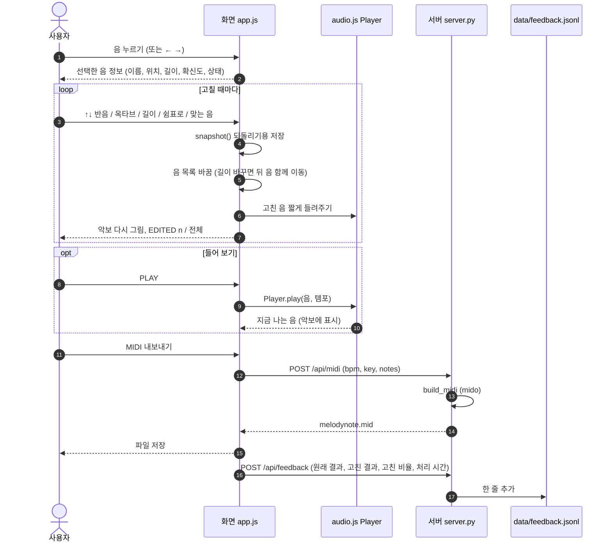
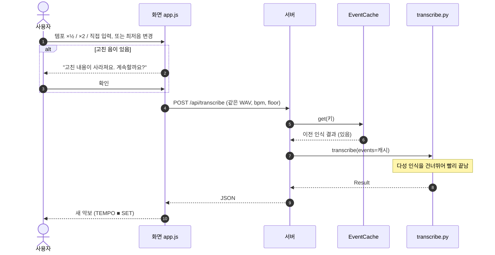
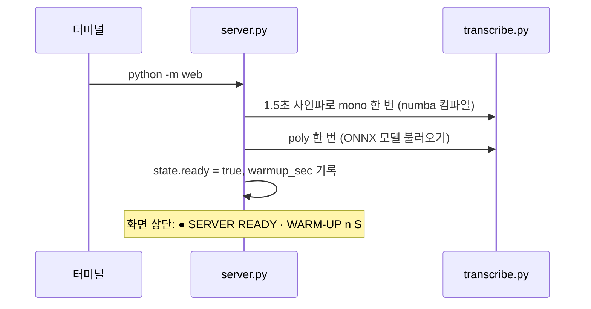

# 시퀀스 다이어그램

현재 코드(`web/`, `pipeline/`) 기준.

## 1. 녹음 → 악보

```mermaid
sequenceDiagram
    autonumber
    actor U as 사용자
    participant A as 화면 app.js
    participant AU as audio.js
    participant S as 서버 server.py
    participant C as EventCache
    participant T as transcribe.py
    participant M as 음 인식 (poly.py / pitch.py·segment.py)
    participant R as rhythm.py

    U->>A: 녹음 버튼 또는 파일 올리기
    A->>AU: Recorder.start() / 파일 읽기
    Note over AU: 마이크: 잡음 제거·자동 음량 끔<br/>60초가 되면 자동 정지
    AU-->>A: 녹음 Blob
    A->>AU: decodeToMono()
    AU-->>A: 22.05kHz 모노 샘플, 길이
    alt 60.5초 초과
        A-->>U: "1분 이내 녹음만 변환할 수 있어요" (PREPARE FAILED)
    else 1분 이내
        A->>AU: encodeWav()
        A->>S: POST /api/transcribe (WAV, mode, bpm?, floor?)
        Note over A: 처리 띠 RUNNING, 경과 시간 표시
        S->>S: sha1(파일) = 캐시 키
        S->>T: transcribe(path, mode, bpm, floor, events?)
        T->>T: load_audio (librosa, 안 되면 PyAV)
        alt mode = poly
            S->>C: get(키)
            C-->>S: 이전 인식 결과 또는 없음
            opt 캐시에 없음
                T->>M: detect_all (basic-pitch, ONNX)
                M-->>T: 모든 음 (양손 전체)
                T->>C: put(키, 모든 음)
            end
            T->>M: auto_floor → pick_melody (가장 높은 줄)
        else mode = mono
            T->>M: track_pitch (pYIN) → segment_notes
        end
        M-->>T: 음 목록 (초 단위)
        alt 음이 없음
            T-->>S: status=no_notes
            S-->>A: 200 JSON
            A-->>U: "음을 찾지 못했어요…" (FAILED)
        else 음이 있음
            T->>R: estimate_tempo → quantize → estimate_key
            R-->>T: 16분음표 격자 위 음, 템포, 조
            T-->>S: Result (status, notes, timings …)
            S-->>A: 200 JSON
            A->>A: 단계별 소요 시간 표시, 상태 문구
            A->>A: score.render (VexFlow)
            A-->>U: 악보, 조·박자·템포, 불확실 음(?)
        end
    end
```

## 2. 고치기 → MIDI 내보내기

고치기는 모두 브라우저 안에서 일어나고, 서버는 내보낼 때만 부른다.

```mermaid
sequenceDiagram
    autonumber
    actor U as 사용자
    participant A as 화면 app.js
    participant AU as audio.js Player
    participant S as 서버 server.py
    participant F as data/feedback.jsonl

    U->>A: 음 누르기 (또는 ← →)
    A-->>U: 선택한 음 정보 (이름, 위치, 길이, 확신도, 상태)
    loop 고칠 때마다
        U->>A: ↑↓ 반음 / 옥타브 / 길이 / 쉼표로 / 맞는 음
        A->>A: snapshot() 되돌리기용 저장
        A->>A: 음 목록 바꿈 (길이 바꾸면 뒤 음 함께 이동)
        A->>AU: 고친 음 짧게 들려주기
        A-->>U: 악보 다시 그림, EDITED n / 전체
    end
    opt 들어 보기
        U->>A: PLAY
        A->>AU: Player.play(음, 템포)
        AU-->>A: 지금 나는 음 (악보에 표시)
    end
    U->>A: MIDI 내보내기
    A->>S: POST /api/midi (bpm, key, notes)
    S->>S: build_midi (mido)
    S-->>A: melodynote.mid
    A-->>U: 파일 저장
    A->>S: POST /api/feedback (원래 결과, 고친 결과, 고친 비율, 처리 시간)
    S->>F: 한 줄 추가
```

## 3. 템포·최저음만 바꿔 다시 맞추기

```mermaid
sequenceDiagram
    autonumber
    actor U as 사용자
    participant A as 화면 app.js
    participant S as 서버
    participant C as EventCache
    participant T as transcribe.py

    U->>A: 템포 ×½ / ×2 / 직접 입력, 또는 최저음 변경
    alt 고친 음이 있음
        A-->>U: "고친 내용이 사라져요. 계속할까요?"
        U->>A: 확인
    end
    A->>S: POST /api/transcribe (같은 WAV, bpm, floor)
    S->>C: get(키)
    C-->>S: 이전 인식 결과 (있음)
    S->>T: transcribe(events=캐시)
    Note over T: 다성 인식을 건너뛰어 빨리 끝남
    T-->>S: Result
    S-->>A: JSON
    A-->>U: 새 악보 (TEMPO ■ SET)
```

## 4. 서버 시작

```mermaid
sequenceDiagram
    participant O as 터미널
    participant S as server.py
    participant T as transcribe.py
    O->>S: python -m web
    S->>T: 1.5초 사인파로 mono 한 번 (numba 컴파일)
    S->>T: poly 한 번 (ONNX 모델 불러오기)
    S->>S: state.ready = true, warmup_sec 기록
    Note over S: 화면 상단: ● SERVER READY · WARM-UP n S
```
